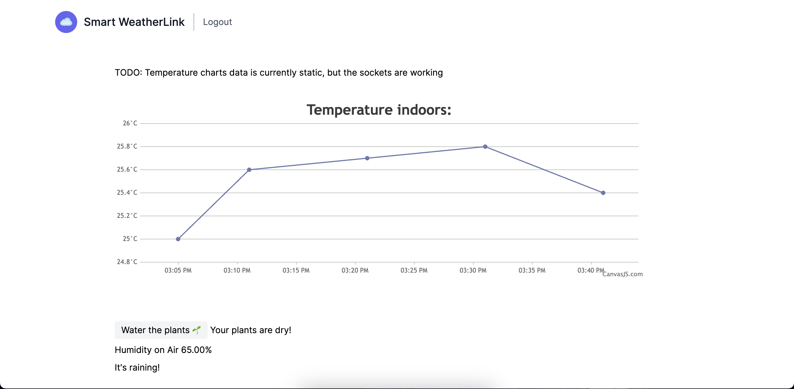
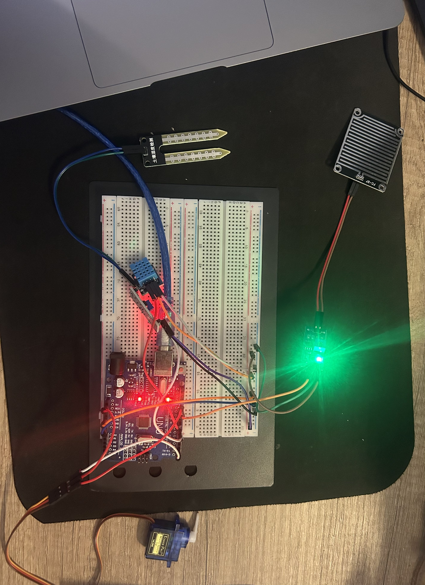

# Smart-Weather-Link

IoT project works with Arduino Uno, receiving the data with NodeJs through sockets, displaying on Angular!

It detects temperature and humidity indoors and checks your plant's moisture, you can run a servo to water the plant. It can detect rain with the sensor.

## Which sensors are used?

```
    FC-37 Rain Sensor
    Soil Moisture Sensor
    DHT-11 Temperature-Humidity Sensor
    SG90 RC Mini (9gr) Servo
```

## How to run it?

For API(Nodejs):

```
    (for installing the packages) => $ npm install
    $ cd api && node server.js
```

For UI(Angular):

```
    (for installing the packages) => $ npm install
    $ cd angular && ng serve
```

How to upload Arduino Uno Code:

```
    (for installing the IDE) => $ brew install --cask arduino-ide
    Open the File
    Install library for DHT
    Choose board and port => Arduino Uno/ and the usb port arduino connected
    Upload(⌘U)
```

Picture from v1: 😄





`If you need help with connecting the sensors to the breadboard, you can use circuito.io visually adding the sensors`

### [Ekim Basoglu](https://www.ekimbasoglu.com)
